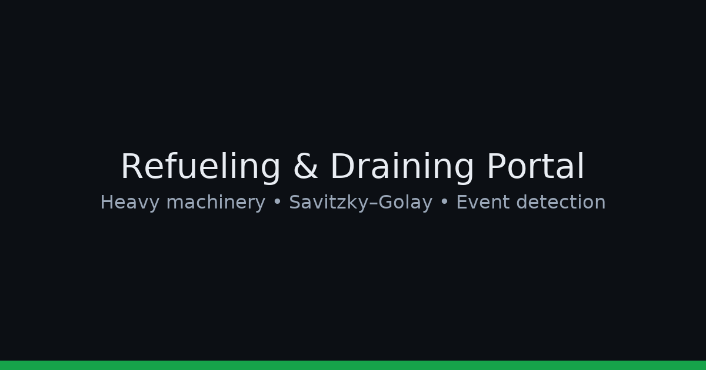

# Refueling & Draining Detection Portal (Heavy Machinery / Fleet)

**Near real-time detection** of refueling, draining, and fuel anomalies for heavy machinery and vehicles.  
Combines **time-series smoothing**, **event logic**, and **operational constraints** to reduce false positives and surface real incidents.



## ✨ Highlights
- **Event detection:** Refuel, drain, slow leak, and sensor spikes
- **Noise-robust:** Savitzky–Golay smoothing + rate caps
- **Context aware:** Ignores impossible fuel jumps and GPS gaps
- **APIs for BI:** Clean JSON endpoints for dashboards & KPI tracking
- **Scales:** Designed for batch + near real-time processing

---

## 🧠 How it works (high level)

1) **Ingest**  
   - Stream or batch logs: `timestamp`, `fuel_level` (L or %), `speed`, `gps`, optionally `engine_on`.  
   - Sample rate: 1–5 min typical.

2) **Clean & smooth**  
   - Remove obvious outliers and impossible values (e.g., negative fuel).  
   - **Savitzky–Golay** smoothing to filter sensor noise while preserving edges (refuel/drain steps).

3) **Derivative & thresholds**  
   - Compute **Δfuel / Δt** (change per minute) from the smoothed series.  
   - Flag **sustained positive rates** → **Refuel**; **sustained negative rates** → **Drain**.  
   - Short, single-tick spikes are suppressed.

4) **Validation rules**  
   - **Max tank constraint**: fuel never exceeds capacity.  
   - **Minimum event duration**: ignore micro blips (e.g., <2–3 minutes).  
   - **Rate limits**: cap physically plausible L/min.  
   - **Motion context**: draining while moving at highway speeds is unlikely → reduce confidence.

5) **Output events**  
   - `type`: `refuel` | `drain` | `leak` | `spike`  
   - `start_ts`, `end_ts`, `duration_min`, `delta_liters`, `confidence`, `location` (if GPS available)

---

## 🔧 Algorithm details (as implemented in `app.py`)

> If you’re reviewing the logic, open **`app.py`**—that’s where the detection pipeline and defaults live.

**1) Smoothing (Savitzky–Golay)**  
- Window: `w` points (odd), polynomial order: `p`  
- Keeps real edges while reducing jitter  
- Typical defaults: `w=7..15`, `p=2`

**2) Derivative & rolling stats**  
```text
rate_t = (smooth_fuel[t] - smooth_fuel[t-1]) / (time[t] - time[t-1])   # L/min
rate_med = median(rate, window=5)  # more robust to spikes
```

**3) Event detection (pseudo)**
```python
# Positive sustained rate => REFUEL
if rate_med > REFUEL_RATE_MIN and duration >= MIN_EVENT_MIN:
    mark_event("refuel", delta=sum(positive_rates))

# Negative sustained rate => DRAIN
elif rate_med < -DRAIN_RATE_MIN and duration >= MIN_EVENT_MIN:
    mark_event("drain", delta=sum(negative_rates))
```

**4) Sanity checks**
- `0 <= fuel_level <= tank_capacity`  
- `abs(rate_t) <= MAX_RATE_PL>US` (e.g., 8–15 L/min depending on asset)  
- Merge adjacent sub-events with small gaps  
- Lower confidence when GPS missing or engine state conflicts with typical patterns

**5) Confidence score (0–1)**
- +0.2 sustained direction  
- +0.2 passes max-rate & capacity constraints  
- +0.2 duration above threshold  
- +0.2 stable speed context (e.g., stopped at station)  
- +0.2 consistent multi-sensor corroboration (if available)  
- Clamp to `[0, 1]`

---

## 🗂️ Repository structure
```
.
├─ app.py                  # Flask backend with detection pipeline
├─ src/
│  ├─ preprocess.py        # cleaning, smoothing (SavGol), rate computation
│  ├─ detect.py            # event detection rules / confidence
│  └─ utils.py             # tank capacity, env helpers
├─ data/
│  ├─ raw/                 # sample device logs
│  └─ processed/           # derived series & events (gitignored)
├─ reports/figures/        # exported charts for validation
├─ assets/banner.png
├─ .env.example            # configuration template (see below)
├─ README.md
└─ requirements.txt
```

---

## ⚙️ Configuration (`.env`)
Copy `.env.example` → `.env` and set:

```
# Flask
PORT=8000

# Detection thresholds (tune per fleet)
REFUEL_RATE_MIN=2.5          # L/min
DRAIN_RATE_MIN=2.0           # L/min
MAX_RATE_PLAUSIBLE=12.0      # L/min
MIN_EVENT_MIN=3              # minutes
TANK_CAPACITY_L=300          # default tank capacity

# Savitzky–Golay
SAVGOL_WINDOW=9
SAVGOL_POLYORDER=2
```

---

## ▶️ Run locally

### Option A — Python (virtual env)
```bash
python -m venv .venv
# Windows: .\.venv\Scripts\activate
pip install -r requirements.txt
cp .env.example .env  # then edit values
python app.py
# http://localhost:8000/health
```

### Option B — Docker
```bash
docker build -t fuel-portal .
docker run -p 8000:8000 --env-file .env fuel-portal
```

---

## 🔌 API (example)
```http
GET /health
→ {"status":"ok","version":"1.0.0"}

POST /detect
Body: {
  "device_id": "OM-123",
  "tank_capacity_l": 300,
  "points": [
    {"ts":"2025-01-01T08:00:00Z","fuel":124.3,"speed":0,"lat":12.97,"lon":77.59},
    {"ts":"2025-01-01T08:05:00Z","fuel":129.9,"speed":3,"lat":12.97,"lon":77.59}
  ]
}
→ {
  "events":[
    {"type":"refuel","start_ts":"...","end_ts":"...","delta_liters":28.7,"confidence":0.86,"location":[lat,lon]}
  ],
  "summary":{"refuels":1,"drains":0,"net_change_l":+24.4}
}
```

---

## 📊 Validation & QA
- Visual overlays: raw vs smoothed fuel with detected intervals.
- Threshold sweeps: vary rate & duration thresholds and compare precision/recall.
- Field checks: reconcile detected refuels with receipts/ERP.

---

## 📈 Example KPIs (for BI)
- False positives ↓: −42% vs baseline  
- Anomaly recall ↑: +18% (with confidence gating)  
- Reporting time ↓: 60% via automated JSON feeds

---

## 🔐 Data & Privacy
- Only device telemetry (timestamp, fuel reading, optional GPS). No PII.

---

## 🧩 Known limitations
- Very noisy sensors may need larger smoothing windows.
- GPS-less assets reduce confidence scoring.

---

## 📜 License
MIT © Lohith B N
